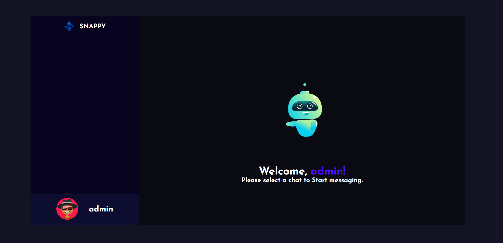

# PluseTalk - Chat Application 
PulseTalk is chat application build with the power of MERN Stack.


)




## Installation Guide

### Requirements
- [Nodejs](https://nodejs.org/en/download)
- [Mongodb](https://www.mongodb.com/docs/manual/administration/install-community/)

Both should be installed and make sure mongodb is running.

```shell
git clone https://github.com/koolkishan/chat-app-react-nodejs
cd chat-app-react-nodejs
```
Now rename env files from .env.example to .env
```shell
cd public
mv .env.example .env
cd ..
cd server
mv .env.example .env
cd ..
```

Now install the dependencies
```shell
cd server
yarn
cd ..
cd public
yarn
```
We are almost done, Now just start the development server.

For Frontend.
```shell
cd public
yarn start
```
For Backend.

Open another terminal in folder, Also make sure mongodb is running in background.
```shell
cd server
yarn start
```

Done! Now open localhost:3000 in your browser.
